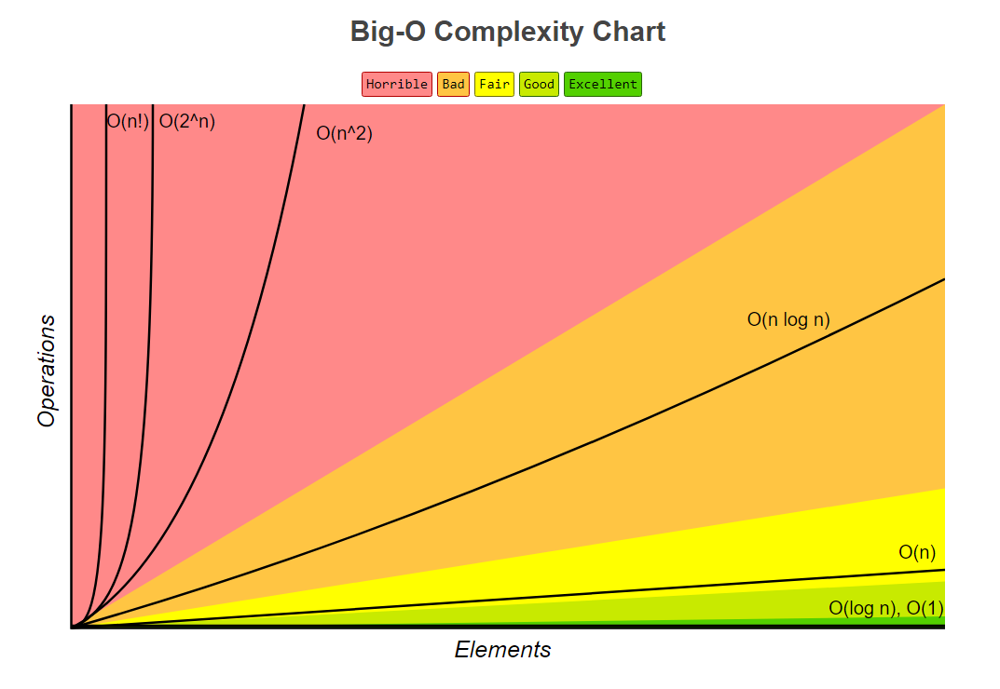

# Collections

| Interfaces | Hash table Implementations | Resizable array Implementations | Tree Implementations | Linked list Implementations | Hash table + Linked list Implementations |
| :--- | :--- | :--- | :--- | :--- | :--- |
| `Set` | `HashSet` |   | `TreeSet` |   | `LinkedHashSet` |
| `List` |   | `ArrayList` |   | `LinkedList` |   |
| `Queue` |   |   |   |   |   |
| `Deque` |   | `ArrayDeque` |   | `LinkedList` |   |
| `Map` | `HashMap` |   | `TreeMap` |   | `LinkedHashMap` |

## Implementations

### SET

#### HashSet

#### TreeSet

#### LinkedHashSet

### LIST

#### ArrayList - dynamically array stores value and index

#### Linked list - each node has value and reference to the next node

### MAP

## Big O notation \(**Asymptotyczne tempo wzrostu\)**

miara określająca zachowanie wartości funkcji wraz ze wzrostem ilości jej argumentów



