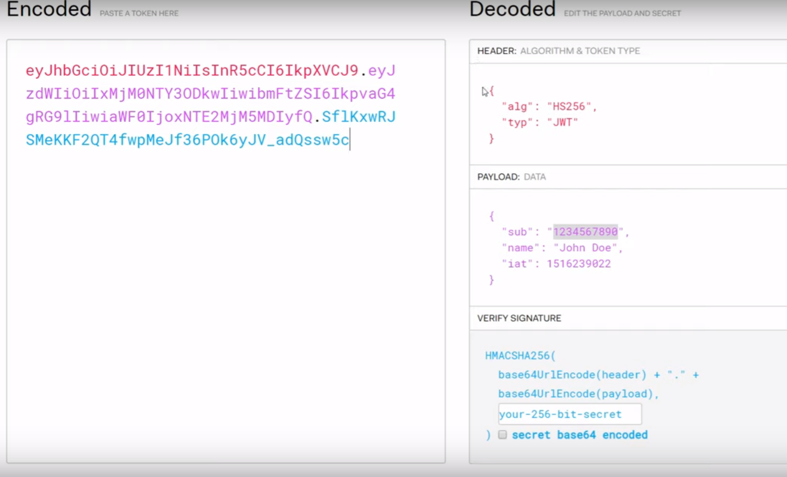

# Security

### JWT

JSON web token

### OpenID connect

uses JWT and adds some other usefull endpoints

### oAuth - it authorizes user

three roles: 

* USER
* API \(authorization server, resource server\)
* CLIENT \(my app\)

CLIENT sends token request to API, gets token, gives to USER,   
USER sends it to API \(by another webView\), API signs this token,   
USER sends signed token to CLIENT, CLIENT sends it to API, and receives Access Token,   
CLIENT uses this access token to communicate with API without bothering USER

#### Auth stage

#### Login stage

#### Access token request stage

it uses OpenId to autenticate USER

