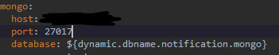
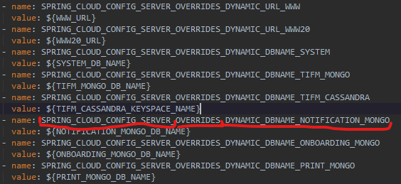

# config server

## OVERRIDES

there is a .yml file in configuration files \(hosted from Git\):



and during config-server deployment it can be also set as \(using overrides\):



this corresponds to settings in application.yml:

```text
spring:
  cloud:
    config:
      server:
        overrides:
          foo: bar
```

