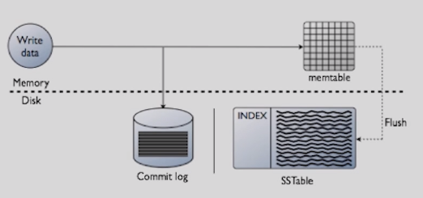

# DB

## CAP theorem

Consistency  
Availability  
Partition tolerance

In distributed database system only two of the following can be guaranteed:


## ACID \(transactions\)

### Atomicity

Transactions composed with several statements should execute all statements on none. Success completely or fail completely

### Consistency

Every transaction should leave system in consistent state. Put system from one valid state to another valid state

### Isolation

Concurrent transactions should leave system in same state as they would be run in sequential. Effect of one incomplete transaction should have no effect on others concurrent transactions  

### Durability

Once transaction is successfully committed, state of the system should remain even after system failure 

## RDBMS - relational database management system

## Relational vs. noSQL

relational DB are optimized for fast writes \(entities are granulated\) and when we query for complex objects we need to join tables together

noSQL are opposite of above - every table is already the query result, so you need to know all queries upfront

## MongoDB

### Export query result to JSON

query file content example:

```text
var collection = db.getCollection('curriculum_group_tree').aggregate([
    // {$limit: 1},
    {$addFields: {"publishedLearningFactors.childFactors.childFactors.currName": "$name"}},

    {$project: {chlf: "$publishedLearningFactors.childFactors.childFactors"}},

    {$unwind: "$chlf"},
    {$unwind: "$chlf"},
    {$unwind: "$chlf"},
    {
        $addFields: {
            "chlf.subIds": {
                "$reduce": {
                    "input": "$chlf.linkedSourceList.subcategoryIdList",
                    "initialValue": [],
                    in: {$concatArrays: ["$$value", "$$this"]}
                }
            }
        }
    },

    {
        $project: {
            "chlf._id": 1, "chlf.currName": 1, "chlf.name": 1, "chlf.subIds": 1
        }
    },

    {$replaceRoot: {newRoot: "$chlf"}},
]);

while (collection.hasNext()) {
    var element = collection.next();

    if (element.subIds && element.subIds.length > 0) {
        for (var item of element.subIds) {
            print(element._id.hex() + "," + JSON.stringify(element.name) + "," + element.currName + "," + item);
        }
    } else {
        print(element._id.hex() + "," + JSON.stringify(element.name) + "," + element.currName + ",");
    }

}

```

CLI:

mongo -u &lt;username&gt; -p &lt;password&gt; --quiet &lt;dbName&gt; &lt;queryFilePath&gt;.js &gt; &lt;resultFileName&gt;.json

## Cassandra

```text
CREATE TABLE IF NOT EXISTS learning_scores.exercise(
  student_id bigint, 
  solution_time timestamp,
  exercise_id bigint,
  score float,
  activity_type text,
  activity_id bigint,
  primary key (student_id, exercise_id,solution_time)
  ) WITH CLUSTERING ORDER BY (exercise_id DESC ,solution_time DESC);
```

* The **Partition Key** is responsible for data distribution across your nodes \(student\_id\)
* The **Clustering Key** is responsible for data sorting within the partition \(exercise\_id, solution\_time\)

Replication factor - on how many nodes data should be replicated  
Consistency level - how many replies should Cassandra have to respond OK  
ALL - all replicas should be written, QUORUN - majority \(RF=5 &gt; CL =3, etc\) , ONE - sends OK when only one write to happen \(lower is faster IO and high available\)

#### Write



for each flush SSTable is created, later async merge process \(compaction\)

#### Tombstone

after data has been deleted instead of erasing, the tombstone \(nagrobek\) is set that data is deactivated

#### Logs

There are three types of Log files in /var/log/

1. cassandra.out
2. system.log
3. gc-&lt;number&gt;.log

tracing on;

### Get started with cassandra on docker

`$ winpty docker exec -it cassandra-db bash    
cqlsh    
desc keyspaces;    
use <keyspace>;    
desc tables;`

## Other:

denormalize - put data from some tables into another one to prevent joins and increase performance, but this approach introduces data redundancy

sharding - different data on different masters, DBs, different places

## TRUNCATE vs DELETE

TRUNCATE TABLE deletes all records in a table by deallocating the data pages used by the table. This reduces the resource overhead of logging the deletions, as well as the number of locks acquired. Records cannot be restored. Cannot specify a WHERE clause, it is all or nothing.

DELETE TABLE statements delete rows one at a time, logging each row in the transaction log, as well as maintaining log sequence number \(LSN\) information. Although this consumes more database resources and locks, these transactions can be rolled back if necessary. You can also specify a WHERE clause.

##  **HAVING vs**. WHERE

 The WHERE clause applies the condition to individual rows before the rows are summarized into groups by the GROUP BY clause. However, the **HAVING** clause applies the condition to the groups after the rows are grouped into groups.

