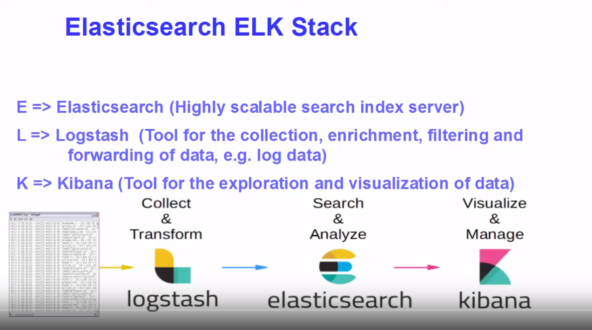

# ELK

have to user same version of elasticsearch and kibana



## ElasticSearch

configuration  
\[elasticsearch\_path\]/conf/elasticsearch.yml  
\[elasticsearch\_path\]/conf/jvm.options

#### Import/Export dumps: 

[https://github.com/taskrabbit/elasticsearch-dump](https://github.com/taskrabbit/elasticsearch-dump)

`$ elasticdump --limit 10000 --input "/c/Users/mario/Desktop/ELK/original/events-index_data-2019.12.11-01.50.json" --output=h`[`ttp://localhost:9200/events`](http://localhost:9200/events)

## Kibana



configuration  
\[kibana\_path\]/conf/kibana.yml  
uncomment or add  
`elasticsearch.hosts: ["http://localhost:9200"]`



### POSTMAN

